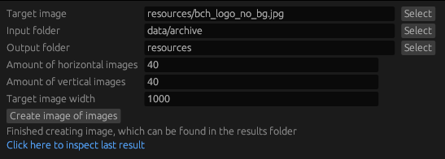
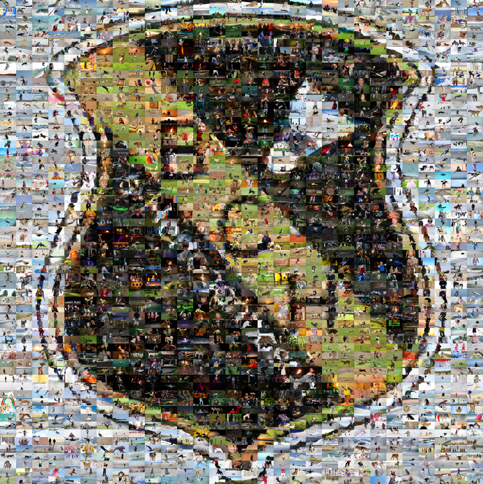

# Image of images
So-manieth repository which contains a tool for generating an image composed of multiple other images

## How to use

### Use the user interface
Download one of the released binaries and execute it:
| Platform | Download |
|--------|-------|
| Linux   | [image_of_images_gui](https://github.com/NilsHasNoGithub/image_of_images/releases/download/v0.3.0/image_of_images_gui)  |
| Windows | [image_of_images_gui.exe](https://github.com/NilsHasNoGithub/image_of_images/releases/download/v0.3.0/image_of_images_gui.exe)  |
<!-- | Apple (failed) | Build failed -->
This should show a window which look like the following:



### Or compile & run using cargo:
```
cargo run -p image_of_images_gui --release
```

### Or use the cli
```
cargo run -p image_of_images_cli --release -- --in-folder <folder_with_images> --target-img <jpg_image_to_replicate> --out-dir <folder_to_store_results>
```

## Example
A logo composed of images from the [Flickr8K](https://www.kaggle.com/adityajn105/flickr8k/activity) dataset.

Generated with:
```
cargo run -p image_of_images_cli --release -- --input-dir data/archive --target-img resources/bch_logo_no_bg.jpg --output-dir resources
```

The original logo:


The logo composed of images:


